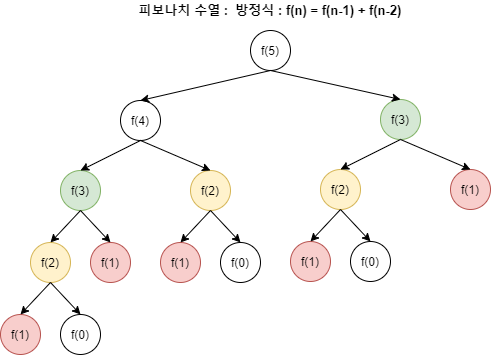
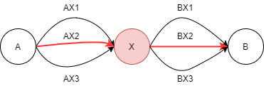

## 목차

1. 개요
2. DP 사용 조건
3. DP 사용 방법
4. 구현 방식, 예시
5. 참조

# Dynamic Programing(DP, 동적 계획법)
## 1. 개요
- DP는 **하나의 큰 문제를 여러 개의 작은 문제로 나누고, 그 결과를 저장하여 다시 큰 문제를 해결할 때 사용하는** 문제해결의 패러다임이다.  
- 재귀함수와 다르게 앞서 계산된 값을 다시 반복할 필요가 없으므로, 시간복잡도의 개선이 가능하다.(O(n^2) >> O(f(n)))
## 2. 사용 조건
- **곂치는 부분 문제**
- **최적 부분 구조**
---
### 2-1. 곂치는 부분 문제(Overlapping Subproblems)
- DP를 사용하기 위해서는 동일한 작은 문제(부분 문제)들이 반복하여 나타야 한다. 
    <figure>
    
    </figure>
- 예를 들면 위의 파보나치 수열에서, f(2) >> f(1), f(0) 의 구조는 3번 반복 사용되었다. 따라서, 이 값을 미리 저장해 두면 연산 횟수가 확연히 줄어들 것이다.  
### 2-2. 최적 부분 구조(Optimal Substructure)
- **부분 문제의 최적 결과 값을 사용해 전체 문제의 최적 결과를 낼 수 있는 경우**를 의미한다. 
    <figure>
    
    </figure>
- 예를 들어 위의 경우, A에서 X를 거쳐 B로 가는 최단경로를 찾을 때 각각 A에서 X로 가는 경우와 X에서 B로 가는 경우의 최단경로인 AX2와 BX2가 전체 최단경로와 같다.  
## 3. 사용 방법
### 1. DP로 풀 수 있는 문제인지 확인
- 일정한 패턴이 있는지 즉, 현재 직면한 문제가 작은 문제들로 이루어진 하나의 함수로 표현될 수 있는지에 대한 판단
### 2. 문제의 변수 파악(어떤 규칙이 있는지)
- 일정한 패턴이 있다면, 변수의 갯수 즉, 
3. 변수 간 관계식 만들기(점화식 작성)
4. 메모하기(기억할 공간 할당)
5. 기저 상태 파악하기
6. 구현하기
